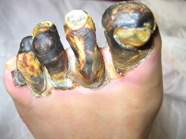

##### ¿Qué es la diabetes?

La diabetes es una enfermedad que ocasiona niveles elevados de glucosa (azúcar) en la sangre, existen dos niveles de diabetes:

1. Diabetes tipo 1
  * 	Su cuerpo no produce insulina.
2. Diabetes tipo 2
  * 	Su cuerpo no produce insulina, tampoco la utiliza de manera adecuada.

##### ¿Qué es el pie diebético?

Un problema muy común en las personas que tienen diabetes son los pies, estos presentan daños en los nervios y los vasos sanguíneos de los pies, se presenta cuando los niveles de azúcar son altos, este daño se le conoce como “Neuropatía Diabética”, sus principales síntomas son:

* 	Hormigueos y calambres.
* 	Ausencia de sensibilidad.
* 	Aparición de úlceras en la piel del pie.

La mayoría de las heridas son causadas por una disminución de la sensibilidad del pie y surgen en la planta o en algunas zonas cercanas al hueso, como los nudillos de los dedos.

##### ¿Cuándo debería de consultar a un profesional?

* 	Un corte o una ampolla que no sana en días.
* 	Piel caliente, enrojecida o adolorida en sus pies.
* 	Sangre en el interior de un callo.
* 	Pie con infección donde la piel se vuelve negra y huele mal.

##### ¿Cómo me ayuda el Ozono?

Se estimula el sistema circulatorio para aumentar el flujo sanguíneo, regresar a la sangre su capacidad de pasar a través de todos los vasos sanguíneos aun por los más pequeños y dañados pues en esta enfermedad mucha de esta micro circulación disminuye grandemente y es lo que ocasiona dolor o falta de sensibilidad.

##### Recomendación

> La mejor manera de proteger sus pies es controlando sus niveles de azúcar en sangre todos los días.

##### Pie diabético con gangrena

